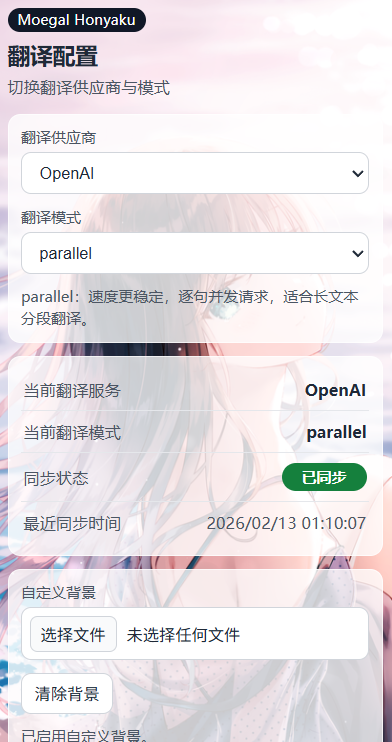

# Moegal Honyaku FE

一个给网页漫画图一键翻译的浏览器插件。

## 这个插件能做什么

- 鼠标放到图片上，点“翻译图片”
- 在插件里切换翻译模式
- 给插件弹窗换背景图

## 使用前准备

1. 先把 Moegal Honyaku 后端程序打开（不打开就无法翻译）。
2. 浏览器建议使用 Chrome 或 Edge。

## 第一次安装（3 步）

1. 打开 `chrome://extensions`。
2. 打开右上角“开发者模式”。
3. 点“加载已解压的扩展程序”，选择当前项目文件夹。

手机使用的办法：
安装Edge Canary：在Google Play搜索并安装 Microsoft Edge Canary。

开启开发者选项：

打开Edge Canary，进入右下角「···」菜单 →「设置」。

拉到最底部，点进「关于 Microsoft Edge」。

连续点击版本号 5-7 次，直到提示"Developer options enabled"。返回上一级，你就会在底部看到「开发人员选项」。

导入安装：

回到Edge Canary的「开发人员选项」，点击 「通过 crx 安装扩展」。

直接发布的是文件夹版本。打包crx需要使用电脑版本的edge选择扩展文件夹，然后打包成crx，然后发送到手机。

## 平时怎么用

1. 打开你要看的网页。
2. 把鼠标移到漫画图上。
3. 点击“翻译图片”，等待几秒即可。
4. 如果要改设置，点击浏览器右上角的插件图标。

自动翻译功能打开之后会自动翻译页面上的图片而不需要每次都手动点击翻译。

- ## 特性

   **新增功能：**
   - 支持 base64 图片自动翻译
   - 自动翻译模式（可开启）
   - 自动保存翻译结果
   - 自定义后端 IP 地址

   **检测优化：**
   - 优化文本检测参数，提高密集气泡检测率
   - 降低 IOU 阈值，减少相邻气泡被合并漏检
   - 支持通过 `.env` 配置检测参数（置信度、IOU、图像尺寸等）

    假如使用服务器布置，出现HTTPS 网页无法翻译？等问题可以用 ngrok 解决

   如果在 HTTPS 网页上翻译失败，是因为浏览器禁止 HTTPS 页面访问 HTTP 后端（混合内容限制）。

   **解决方案：用 ngrok 将本地服务转为 HTTPS**

   1. 下载安装 ngrok：https://ngrok.com/download

   2. 注册账号并获取 authtoken：https://dashboard.ngrok.com/get-started/your-authtoken

   3. 配置 authtoken：
     ngrok config add-authtoken <你的token>

   4. 启动后端服务（假设端口 8000）：
     cd /root/moegal-honyaku-main
     source .venv/bin/activate
     uvicorn main:app --host 0.0.0.0 --port 8000

   5. 另开终端，启动 ngrok：
     ngrok http 8000

   6. ngrok 会显示类似这样的地址：
     Forwarding    https://xxxx-xx-xx-xxx-xx.ngrok-free.app -> http://localhost:8000

   7. 在浏览器插件设置中，将后端地址改为 ngrok 提供的 HTTPS 地址即可。

   ## 常见问题

   - 提示翻译失败：先确认后端程序还在运行。然后如果网站本身需要翻墙才能访问，但是服务器或者本地电脑没有挂梯子。可以打开base64上传来进行解析。（仅测试nhentai和pixiv没有问题。有问题再反馈）
   - HTTPS 网页翻译失败：使用 ngrok 将后端转为 HTTPS（见上方教程）。
   - 漏检某些气泡：可调整后端 `.env` 中的 `DET_CONF_THRESHOLD`（降低以检测更多）和 `DET_IOU_THRESHOLD`
   （降低以减少合并）。

